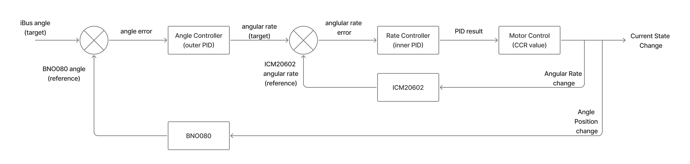

### Personal Project: Drone Assembly & FC Firmware Development

**Objective:**  
Teach myself drone assembly and flight controller development using online resources.

**Goal:**  
Design and build a **high-performance, low-cost quadcopter** with the following features:
- Remote control capability  
- GPS integration  
- Custom flight controller developed in **C**

Flight Control Loop Diagram (Cascade PID)

